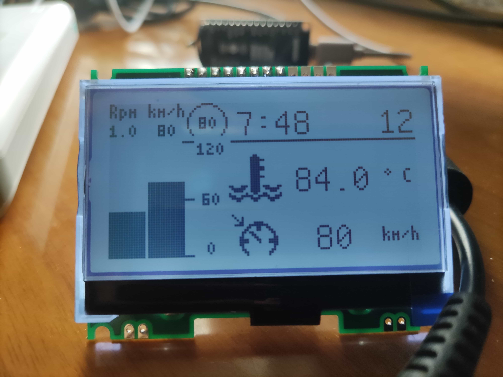

# esp8266-wireless-display

ESP8266 wireless display.
based on microython 1.14


# Hardware
st7565 LCD screen, 128x64.

[JLX 12864G-928-PN](https://item.taobao.com/item.htm?id=599119650683)

| GPIO | SCREEN    |
| :--: | :-----:   |
| 0    | LEDA      |
| 2    | RS(CMD)   |
| 4    | RST       |
| 5    | CS        |
| 13   | SCK       |
| 14   | SDA(MOSI) |

# Install and Useage
Make sure ESP8266 is in the same network.

Add a file named ```config.py```:
```py
# config
wifi_ssid = 'YourWifiName'
wifi_password = 'YourWifiPassword'
```

Use [mpypack](https://github.com/Dreagonmon/mpypack) to upload:
```bash
pip install mpypack
mpypack -p PORT sync
```

Use librarys in ```.pc/lib``` folder to write your applications.

The preview image shows the example ```.pc/TruckTelemetry```, a Euro Truck Simulator 2 external display screen.
